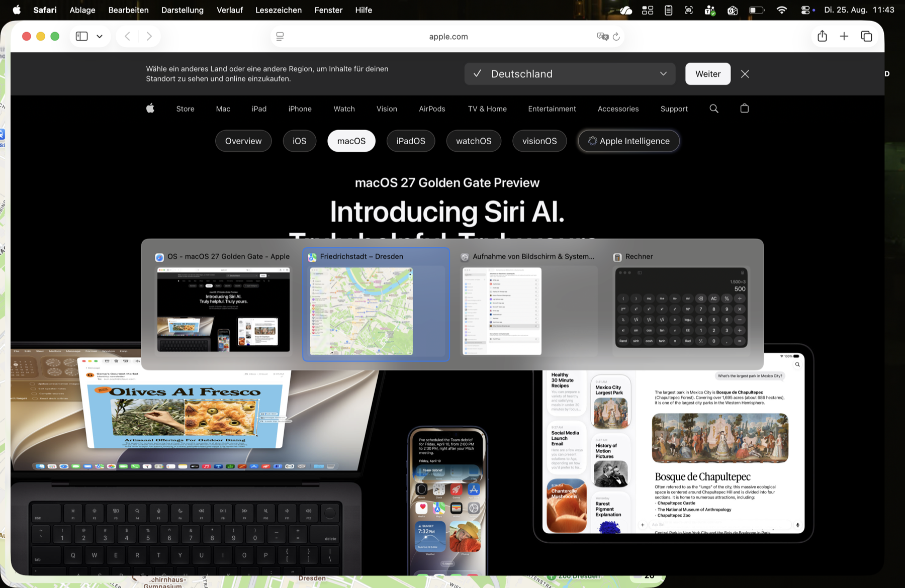

# Tappi

[](https://github.com/leonatwork/Tappi/actions/workflows/build.yml)
[](https://github.com/leonatwork/Tappi/releases/latest)

[](LICENSE)

Ein Fensterwechsler für macOS, der sich anfühlt wie Alt-Tab unter Windows — und zwar
**sofort**. Kein Warten, kein Ruckeln, keine CPU-Spitzen beim Drücken.

Standard-Hotkey: <kbd>⌘</kbd><kbd>Tab</kbd> — Tappi übernimmt die Tastenkombination vom System-Switcher.

*🇬🇧 [English version](README.md) — die englische Fassung ist maßgeblich und wird zuerst
aktualisiert.*

---

## Screenshot

<div align="center">
  
  <br />
  <em>Der Switcher zeigt alle offenen Fenster in zuletzt-benutzt-Reihenfolge</em>
</div>

## Warum

macOS' <kbd>⌘</kbd><kbd>Tab</kbd> wechselt **Apps**, nicht **Fenster**. Wer drei
Browserfenster und zwei Terminals offen hat, landet damit immer nur bei der App und muss
danach nochmal mit <kbd>⌘</kbd><kbd>`</kbd> weitersuchen. Windows wechselt seit jeher
zwischen einzelnen Fenstern — das ist der eigentliche Unterschied, an den man sich gewöhnt.

Es gibt bereits [AltTab](https://github.com/lwouis/alt-tab-macos), das dieses Verhalten
nachbildet. Der Grund für Tappi ist nicht der Funktionsumfang, sondern die Reaktionszeit.
AltTab berechnet die Fenstervorschauen **während man wartet** — das ist in dessen eigenen
Issues dokumentiert: rund 200 ms bei etwa zehn Fenstern
([#45](https://github.com/lwouis/alt-tab-macos/issues/45)), dazu Speicherprobleme durch
`replayd` ([#4194](https://github.com/lwouis/alt-tab-macos/issues/4194)) und spürbare
Verzögerungen bei vielen Fenstern ([#171](https://github.com/lwouis/alt-tab-macos/issues/171)).

Windows fühlt sich schnell an, weil der Compositor (DWM) die Fensterinhalte ohnehin schon
vorliegen hat. Der Switcher muss beim Tastendruck nichts mehr berechnen. Genau dieses
Prinzip setzt Tappi um.

## Das Windows-Verhalten, das hier nachgebaut ist

Recherchiert und Regel für Regel umgesetzt:

- Die Liste enthält **Fenster**, nicht Apps, sortiert nach zuletzt benutzt (MRU).
  Index 0 ist das aktuelle Fenster, Index 1 das davor.
- Beim Öffnen ist **Index 1 vorausgewählt**. Kurz drücken und loslassen springt daher
  direkt zum vorherigen Fenster.
- Die MRU-Reihenfolge wird **erst beim Loslassen** neu sortiert, nie während des
  Durchblätterns. Nur deshalb funktioniert das Hin-und-Her-Wechseln zwischen zwei Fenstern.
- <kbd>⇧</kbd> beim ersten Druck springt ans **Ende** der Liste.
- <kbd>Esc</kbd> bricht ab, ohne zu wechseln.
- <kbd>⌃</kbd> zusätzlich gedrückt öffnet die Liste **fixiert** — sie bleibt offen,
  auch wenn man den Modifier loslässt.
- Maus-Hover wählt aus, Klick wechselt, das „✕" auf der Kachel schließt das Fenster.

## Tastenbelegung

| Taste | Wirkung |
|---|---|
| <kbd>⌘</kbd><kbd>Tab</kbd> | Öffnen und vorwärts blättern |
| <kbd>⌘</kbd><kbd>⇧</kbd><kbd>Tab</kbd> | Rückwärts blättern |
| <kbd>⌘</kbd><kbd>^</kbd> | Nur Fenster der aktuellen App (die Taste über Tab) |
| <kbd>⌘</kbd><kbd>⌃</kbd><kbd>Tab</kbd> | Liste fixiert öffnen (bleibt offen) |
| Pfeiltasten | Auswahl bewegen |
| <kbd>⏎</kbd> / <kbd>Space</kbd> | Bestätigen |
| <kbd>Esc</kbd> | Abbrechen |
| <kbd>W</kbd> | Ausgewähltes Fenster schließen |
| <kbd>Q</kbd> | App des ausgewählten Fensters beenden |

Gemeint ist jeweils die Taste **direkt über Tab** — auf deutschen Tastaturen <kbd>^</kbd>,
auf US-Tastaturen <kbd>`</kbd>. Die beiden Layouts vergeben dort unterschiedliche Keycodes
(ISO meldet 10, ANSI meldet 50, und auf ISO liegt 50 stattdessen auf <kbd><</kbd>), deshalb
akzeptiert Tappi beide.

Der Modifier lässt sich im Menüleisten-Menü auf <kbd>⌥</kbd> oder <kbd>⌃</kbd> umstellen.
<kbd>⌘</kbd> ist die Voreinstellung, weil die Taste dort liegt, wo auf einer PC-Tastatur Alt
liegt — direkt links neben der Leertaste.

### Der System-Switcher

<kbd>⌘</kbd><kbd>Tab</kbd> ist keine normale Tastenkombination: Der Window Server behandelt sie
als *Symbolic Hot Key*, noch bevor irgendein Event Tap sie zu sehen bekommt. Die Taste
abzufangen genügt deshalb nicht — der System-Switcher erscheint trotzdem vor Tappis Panel.
Tappi deaktiviert den Symbolic Hot Key daher, solange es läuft (private CoreGraphics-API,
dieselbe, die AltTab dafür nutzt).

Das ist mit einer Sicherung versehen: **Tappi nimmt <kbd>⌘</kbd><kbd>Tab</kbd> nur weg,
solange es nachweislich arbeitsfähig ist** — Bedienungshilfen erteilt, Event Tap aktiv und
Fenster tatsächlich sichtbar. Fällt eine dieser Bedingungen weg, geht die Tastenkombination
sofort ans System zurück. Auch beim Beenden und bei `SIGTERM`/`SIGINT` wird sie
wiederhergestellt; ein Start nach einem harten Abschuss repariert den Zustand.

## Geschwindigkeit

Gemessen auf macOS 26.6 (Apple Silicon) bei 12 offenen Fenstern mit aktivierten
Vorschaubildern — Zeit vom Tastendruck bis das Panel auf dem Bildschirm steht:

```
visible after 1.1 ms     visible after 1.0 ms
visible after 1.2 ms     visible after 1.7 ms
visible after 1.2 ms     visible after 1.0 ms
visible after 1.0 ms     visible after 1.2 ms
```

Nachmessen lässt sich das jederzeit mit `TAPPI_DEBUG=1` (siehe unten).

### Wie das erreicht wird

Die Regel lautet: **im Hotkey-Pfad wird nichts berechnet.**

- **Die Fensterliste ist immer warm.** Fenster, Titel, Icons und MRU-Reihenfolge werden
  laufend im Hintergrund gepflegt — angestoßen von Accessibility-Notifications, nicht vom
  Tastendruck. Beim Drücken wird ein fertiges Array gelesen.
- **Alle Accessibility-Aufrufe laufen abseits des Main Threads**, mit hartem Timeout
  (250 ms) pro App. Eine hängende App kann den Switcher damit nicht blockieren.
- **Das Panel existiert bereits.** Es wird beim Start einmal erzeugt und danach nur noch
  ein- und ausgeblendet, statt pro Aufruf neu aufgebaut zu werden.
- **Gezeichnet wird in einer einzigen `draw(_:)`-View** — keine Collection View, kein
  Auto Layout, kein SwiftUI-Diffing zwischen Tastendruck und Pixeln.
- **Vorschaubilder sind rein additiv.** Das Panel erscheint sofort mit App-Icons; die
  Live-Vorschau wird asynchron nachgeladen, in den Cache gelegt und blendet sich in die
  jeweilige Kachel ein. Gewartet wird darauf nie.

Der teuerste Einzelposten war übrigens nicht das Zeichnen, sondern
`CGPreflightScreenCaptureAccess()` — ein synchroner Aufruf an den TCC-Daemon, der pro
Sitzung 13× erfolgte und allein für 120–160 ms Verzögerung sorgte. Das Ergebnis wird jetzt
zwischengespeichert.

Im Leerlauf: rund 1 % CPU-Zeit und ~60 MB RSS.

## Installation

### Fertige App herunterladen

Neuestes Release: **[Tappi.app herunterladen](https://github.com/leonatwork/Tappi/releases/latest)**

1. ZIP entpacken und `Tappi.app` nach `/Applications` ziehen
2. Beim ersten Start **Rechtsklick ▸ Öffnen** (nicht Doppelklick)

Schritt 2 ist nötig, weil die Release-Builds nicht notarisiert sind — dafür wäre ein
kostenpflichtiges Apple-Entwicklerkonto erforderlich. Alternativ:

```bash
xattr -dr com.apple.quarantine /Applications/Tappi.app
```

> Release-Builds sind ad-hoc signiert. macOS bindet erteilte Berechtigungen an die
> Signatur, weshalb sie **nach jedem Update erneut erteilt werden müssen**. Wen das
> stört, baut besser selbst — das dauert eine Minute und löst das Problem dauerhaft.

### Selbst bauen (empfohlen)

Es wird kein Xcode benötigt, die Command Line Tools genügen:

```bash
xcode-select --install
git clone https://github.com/leonatwork/Tappi.git
cd Tappi
./setup-signing.sh
./build.sh --install
```

`setup-signing.sh` legt einmalig eine lokale Signaturidentität an, damit die erteilten
Berechtigungen jeden künftigen Neubau überstehen (Details unter *Damit die Freigabe
erhalten bleibt*). Ohne `--install` landet das fertige Bundle nur in `./dist/`.


### Berechtigungen

- **Bedienungshilfen** (zwingend): Beim ersten Start erscheint der Systemdialog. Ohne
  diese Freigabe kann Tappi weder Tastendrücke sehen noch Fenster in den Vordergrund holen.
- **Bildschirmaufnahme** (optional): Nur für die Vorschaubilder. Da Vorschauen
  voreingestellt an sind, fragt Tappi beim Start danach, sobald sie fehlt. Ohne die
  Freigabe zeigen die Kacheln App-Symbole, alles andere funktioniert unverändert.

  macOS zeigt diesen Systemdialog **nur einmal pro App**. Wurde er einmal abgelehnt,
  führt der Weg nur noch über die Systemeinstellungen — dafür gibt es im Menü den Punkt
  *Bildschirmaufnahme freigeben …*. Und weil ScreenCaptureKit eine frisch erteilte
  Freigabe erst in einem neu gestarteten Prozess sieht, bietet das Menü danach
  *Neu starten, um Vorschauen zu aktivieren* an.

### Damit die Freigabe erhalten bleibt

macOS bindet erteilte Berechtigungen an die Codesignatur — und eine ad-hoc-Signatur wird
über den Hash der Binary identifiziert. **Jeder Neubau erzeugt damit eine neue Identität**,
für die der bestehende Eintrag nicht mehr gilt: Das Häkchen bleibt sichtbar, greift aber ins
Leere, und Tappi meldet „Bedienungshilfen fehlen", obwohl alles freigegeben aussieht.

Der Unterschied im Klartext:

```
ad-hoc        designated => cdhash H"..."               ← ändert sich bei jedem Build
Zertifikat    designated => certificate leaf = H"..."   ← bleibt stabil
```

Deshalb einmalig eine lokale Signaturidentität anlegen:

```bash
./setup-signing.sh
```

Das erzeugt ein selbstsigniertes Codesignatur-Zertifikat und legt es im Login-Schlüsselbund
ab. Ein Admin-Passwort ist nicht nötig: `codesign` akzeptiert eine nicht als vertrauenswürdig
markierte selbstsignierte Identität zum lokalen Signieren. `build.sh` verwendet sie danach
automatisch — die Berechtigungen überstehen jeden weiteren Neubau.

Wer eine Developer-ID hat, nimmt stattdessen diese:

```bash
CODESIGN_IDENTITY="Developer ID Application: Dein Name (TEAMID)" ./build.sh --install
```

### Freigaben zurücksetzen

Wenn aus einer früheren ad-hoc-Installation noch tote Einträge stammen, hilft ein Reset:

```bash
tccutil reset Accessibility de.tappi.Tappi
tccutil reset ScreenCapture de.tappi.Tappi
```

Danach Tappi neu starten und die Freigaben einmal erteilen.


## Einstellungen

Über das Menüleisten-Symbol: Modifier, Einblendeverzögerung, Kachelgröße (112–320 pt),
Vorschaubilder, minimierte Fenster, Fenster anderer Spaces, Fenster ausgeblendeter Apps,
Auswahl-per-Maus und Autostart. Dazu *Diagnoseprotokoll öffnen* und *Tappi neu starten*.

Die Statuszeile ganz oben im Menü sagt, woran es hakt: fehlende Bedienungshilfen, keine
erkannten Fenster oder „ohne Vorschauen".

Alles liegt als JSON in `~/Library/Application Support/Tappi/settings.json` und lässt sich
auch direkt bearbeiten.

Die **Einblendeverzögerung** steht standardmäßig auf 0 ms (Windows-Verhalten). Wer beim
schnellen Hin-und-Her-Wechseln gar kein Panel sehen will, stellt sie auf 60–120 ms — dann
erscheint es nur, wenn man den Modifier tatsächlich gedrückt hält.

## Diagnose

Tappi protokolliert seinen Startvorgang immer nach:

```
~/Library/Application Support/Tappi/diagnostics.log
```

Dort steht, ob die Bedienungshilfen greifen, ob der Event Tap installiert werden konnte und
wie viele Fenster erkannt werden. Die Datei wird bei jedem Start neu angelegt.

Für Details zur Tastenverarbeitung:

```bash
TAPPI_DEBUG=1 /Applications/Tappi.app/Contents/MacOS/Tappi
```

Protokolliert jedes gesehene Tastenereignis samt Entscheidung, ob es geschluckt wurde,
sowie die Latenz jeder Sitzung. Achtung: aus dem Terminal gestartet erbt Tappi die
Berechtigungen des Terminals — für einen ehrlichen Berechtigungstest die App normal starten
und in die Log-Datei schauen.

## Bekannte Grenzen

- Fenster werden über die Accessibility-API erfasst. Apps mit unsauberer
  AX-Unterstützung (manche Java- und Electron-Anwendungen) melden ihre Fenster
  unvollständig.
- Der Wechsel zu einem Fenster auf einem anderen Space löst die übliche
  macOS-Space-Animation aus — daran kann Tappi nichts ändern.
- Das Abschalten des System-Switchers nutzt eine private CoreGraphics-API. Eine
  öffentliche Entsprechung gibt es nicht; ohne sie lässt sich <kbd>⌘</kbd><kbd>Tab</kbd>
  nicht übernehmen.
- Ad-hoc-Signaturen und macOS' Berechtigungsverwaltung vertragen sich schlecht — siehe
  „Damit die Freigabe erhalten bleibt".
- Es läuft immer nur eine Instanz: Startet eine zweite (etwa aus `dist/` neben der
  installierten), beendet sie sich sofort wieder. Zwei Instanzen hätten sonst je einen
  Event Tap installiert und jeden Tastendruck doppelt verarbeitet.
- Getestet auf macOS 26.6, Apple Silicon. Minimum ist macOS 14.

## Aufbau

| Datei | Aufgabe |
|---|---|
| `WindowStore.swift` | Immer aktuelle Fensterliste samt MRU-Reihenfolge |
| `SwitcherController.swift` | Zustandsautomat einer Sitzung (die Windows-Regeln) |
| `EventTap.swift` | Tastenereignisse abfangen, bevor die App sie sieht |
| `SwitcherPanel.swift` | Das vorgehaltene Overlay-Fenster |
| `SwitcherView.swift` | Layout und Zeichnen der Kacheln |
| `ThumbnailProvider.swift` | Asynchrone Vorschaubilder via ScreenCaptureKit |
| `AX.swift` | Accessibility-Aufrufe mit Timeout-Schutz |
| `SystemSwitcher.swift` | Übernahme von ⌘Tab samt Rückgabe-Sicherung |
| `StatusItem.swift` | Menüleisten-Menü |
| `Diagnostics.swift` | Startprotokoll für ein Programm ohne Konsole |

## Mitwirken

Fehlerberichte und Pull Requests sind willkommen — siehe **[CONTRIBUTING.md](CONTRIBUTING.md)**
(auf Englisch)
für Entwicklungsumgebung, Architektur und die Fallstricke, die schon einmal Zeit gekostet
haben. Änderungen pro Version stehen im **[CHANGELOG.md](CHANGELOG.md)**.

Bei Fehlerberichten bitte das Diagnoseprotokoll beilegen (Menüleisten-Symbol ▸
*Diagnoseprotokoll öffnen*). Es enthält keine Fenstertitel oder sonstigen Inhalte.

## Lizenz

[MIT](LICENSE) — freie Nutzung, Änderung und Weitergabe, ohne Gewährleistung.

Tappi ist von Grund auf eigenständig geschrieben und teilt keinen Code mit
[AltTab](https://github.com/lwouis/alt-tab-macos). Für die Übernahme von ⌘Tab wird
dieselbe private CoreGraphics-Funktion verwendet, weil macOS dafür keine öffentliche
Entsprechung anbietet.
